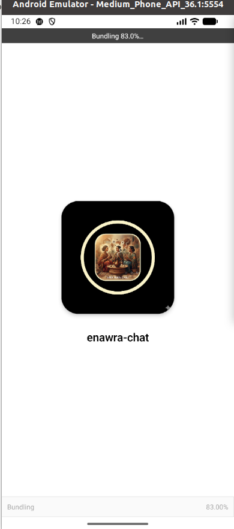
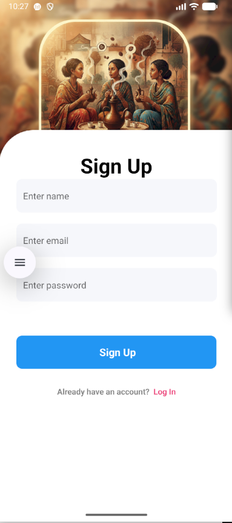
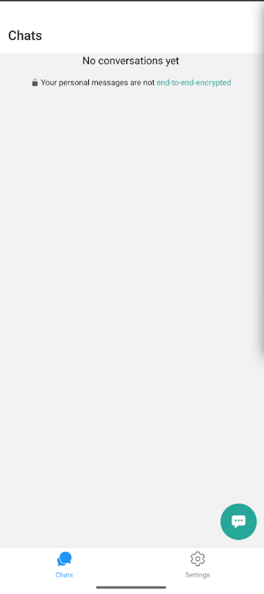
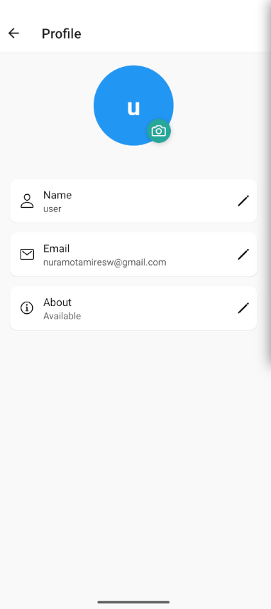
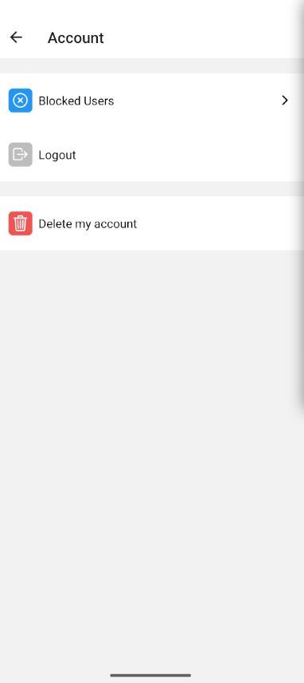

## 💬 Enawra Chat App Template

**Enawra Chat** is a feature-rich, cross-platform chat application template built with **React Native** for both **iOS** and **Android**. It provides a robust, real-time foundation for your development, utilizing **Firebase** for authentication and data management.

---

## ✨ Key Features

| Feature | Description |
| :--- | :--- |
| **Signup and Login** | Secure sign-in using **Firebase Email/Password** authentication. Users can easily register and log in. |
| **Real Time Chat** | Messages update **instantly**, providing a seamless, real-time communication experience. |
| **Send Text Message** | Essential functionality for casual text-based messaging. |
| **Send Picture** | Users can share images with high fidelity; pictures are sent **without losing quality**. |
| **Group Chat** | Ability to send messages to **multiple people** simultaneously, supporting group conversations. |
| **Delete Chat** | Easily manage conversations by holding and selecting chats to **delete** them. |
| **Delete Account** | Option available in settings to permanently **delete your account and associated data**. |
| **Users List** | A comprehensive list of all **registered users**, sorted alphabetically. |
| **Note to Self** | A unique feature allowing users to create **personal notes** by messaging themselves. |

---

## 🛠️ Installation and Setup

Follow these steps to get a local copy of the project running. This template uses **Expo** for quick setup and development.

### Prerequisites

* Node.js (LTS version recommended)
* npm or Yarn
* React Native development environment (Expo CLI recommended)
* A fully configured **Firebase project**.

### Compilation Steps

1.  **Clone the Repository**
    ```bash
    git clone https://github.com/nuramotamire/enawra-chat.git
    cd enawra-chat
    ```

2.  **Install Dependencies**
    ```bash
    npm install
    # or
    # yarn install
    ```

3.  **Configure Environment Variables (Crucial Step)**

    You must create a file named **`.env`** in the root directory (`/enawra-chat/`) and populate it with your configuration keys from your Firebase project settings and Expo configuration.

    **`.env`**
    ```
    # Firebase Config 
    EXPO_PUBLIC_API_KEY=YOUR_FIREBASE_API_KEY
    EXPO_PUBLIC_AUTH_DOMAIN=YOUR_AUTH_DOMAIN
    EXPO_PUBLIC_PROJECT_ID=YOUR_PROJECT_ID
    EXPO_PUBLIC_STORAGE_BUCKET=YOUR_STORAGE_BUCKET
    EXPO_PUBLIC_MESSAGING_SENDER_ID=YOUR_MESSAGING_SENDER_ID
    EXPO_PUBLIC_APP_ID=YOUR_APP_ID
    EXPO_PUBLIC_MEASUREMENT_ID=YOUR_MEASUREMENT_ID

    # Expo Config 
    EXPO_PUBLIC_EAS_PROJECT_ID=YOUR_EAS_PROJECT_ID
    ```

4.  **Run the Application**
    ```bash
    npx expo start
    ```
    Scan the QR code with the **Expo Go** app on your device to view the app on **iOS** or **Android**.

---

## 📸 Screenshots

The following screenshots demonstrate the core functionalities of the application. **Click on any image to view it in full size.** *(Images are located in the `./images/` folder)*

| Screen | Description | Screenshot (Click to enlarge) |
| :--- | :--- | :---: |
| **Loading** | Initial App Load Screen | <a href="images/enawraloading.png"></a> |
| **Login** | Sign in with email and password | <a href="images/enawra-login.png"></a> |
| **Sign Up** | User Registration Screen | <a href="images/enawra-signUp.png"></a> |
| **Chats List** | Main screen showing active chats | <a href="images/chats.png"></a> |
| **Profile** | User's personal details and viewing their own status | <a href="images/profile.png"></a> |
| **Account Settings** | Options including 'Delete Account' | <a href="images/account.png"></a> |

---